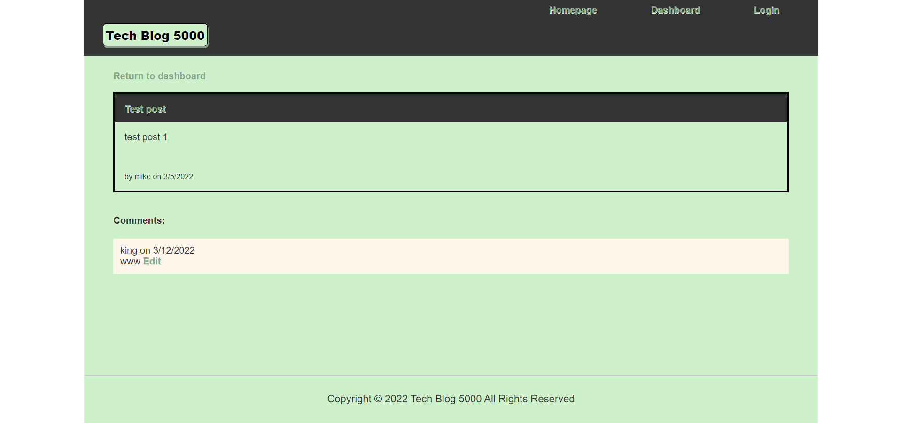

# Tech Blog 5000

## Description

CMS tyle blog site, where users can publish their blog posts and comment on other developers' posts as well.  The application follows the MVC paradigm and is viewed on Heroku via Handlebars templating language.  The ORM for this application is Sequelize and authenticaion is done through the express-session npm package.

## Table of Contents

*[Installation](#installation)

*[License](#license)

*[Contributing](#contributing)

*[Tests](#tests)

*[Questions](#questions)

## Installation

Log in to the MySql shell and type source db/schema.sql.  Once the database is created, quit the shell and run seeds to populate tables by typing npm run seeds in the command line.  Once tables are seeded, the application can be seen on localhost:3001  The unseeded or "fresh" application can be seen by visiting Heroku [here](https://shielded-plateau-85330.herokuapp.com/)

## License
This application is covered under the [MIT](./License/MIT.txt) license.
  
## Contributing

Pull requests are welcome. For major changes, please open an issue first to discuss what you would like to change.

## Tests

All CRUD operations tested through Insomnia

## Questions

If you have any questions, please contact me by [email](mailto:vprmatrix55@gmail.com) or through [Github](https://github.com/Mike2481)

